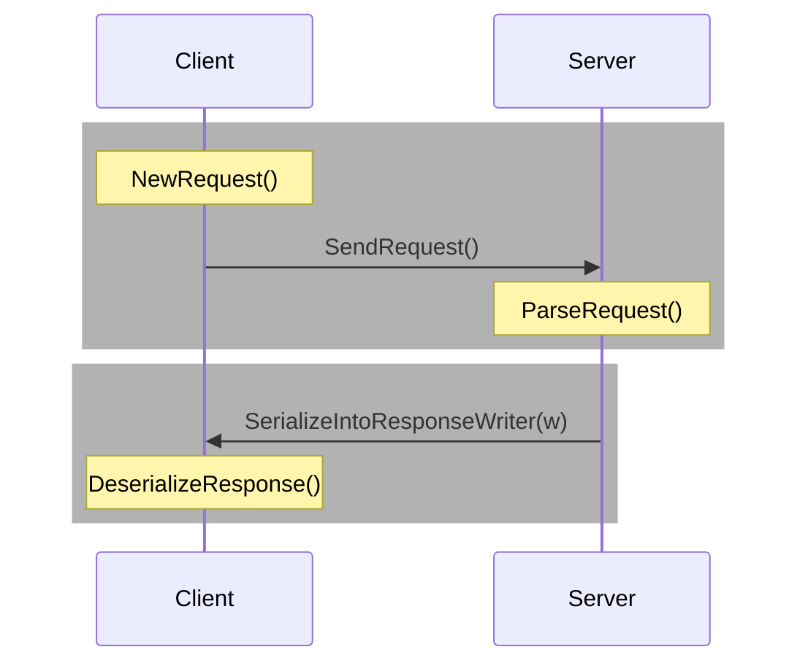

```mermaid
sequenceDiagram

participant c as Client
participant s as Server

rect rgba(0,0,0,0.3)
    Note over c: NewRequest()
    c->>s: SendRequest()
    Note over s: ParseRequest()
end

rect rgba(0,0,0,0.3)
    s->>c: SerializeIntoResponseWriter(w)
    Note over c: DeserializeResponse()
end

```
