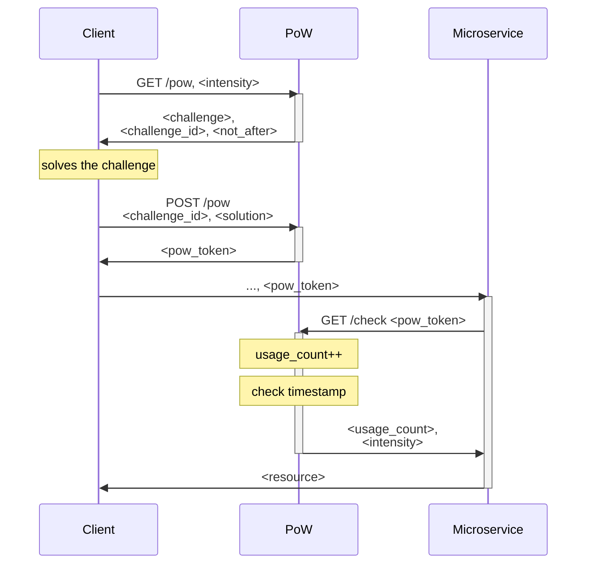

# Proof-of-Work

This service intented to help rest of the services to mitigate DoS attacks and block automated requests.

```mermaid
sequenceDiagram


participant c as Client
participant p as PoW
participant m as Microservice

c->>p: GET /pow, <intensity>
activate p
    p->>c: <challenge>,<br><challenge_id>, <not_after>
deactivate p

Note over c: solves the challenge
c->>p: POST /pow<br><challenge_id>, <solution>
activate p
    p->>c: <pow_token>
deactivate p

c->>m: ..., <pow_token>
activate m
    m->>p: GET /check <pow_token>
    activate p
        Note over p: usage_count++
        Note over p: check timestamp
        p->>m: <usage_count>,<br><intensity>
    deactivate p
    m->>c: <resource>
deactivate m
```
