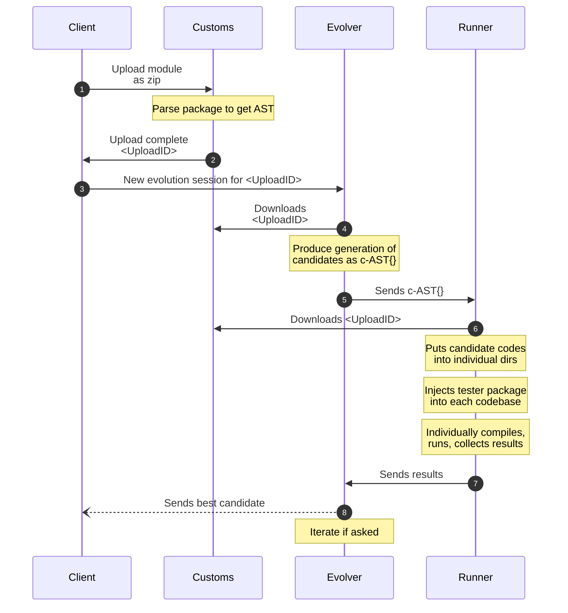

## Communication between processes

```yaml
"User"  : write empty function body into file: main.go
"User"  : write tests with including "testing" package
"User"  : gogp "main.go 50 70" "main_tde.go 10 20"
"gogp"  : initialize candidate pool
"gogp"  : provision virtual environment
"docker": up, copy user app into /app, download "agent" binary from server
"agent" : start listening the port
"gogp"  : send function bodies of one generation's candidates to the "agent"
"agent" : embed function body into "main.go" after "70"th line, seperately
"agent" : embed "asset/main_tde.go" file into the /app folder
"agent" : embed the embedded candidates function names into "asset/main_tde.go" NOTE: Maybe use go:embed?
"agent" : run: `go run -tags "tde"` via "command" package
"agent" : write command output, parse candidate results and send as response body to "gogp"
```

-   Runners:
    -   work in sandbox
    -   registered -> service registry
    -   private to each user
-   Customs:
    -   reachable from open internet


